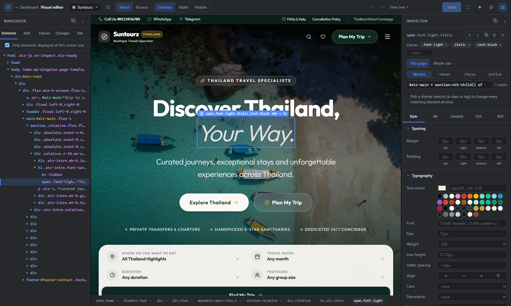

# Suntourz Visual Editor

> A click-to-edit visual editor for **any** WordPress theme. Inspect every element, change text, styles and HTML, move and add elements, save components, manage SEO — and let an AI assistant do it over MCP. No theme files touched.

[](https://github.com/rnd21312/suntourz-visual-editor/actions/workflows/ci.yml)
[](LICENSE)




The editor loads your **real, live site** in a same-origin iframe and works like browser dev tools with a *Save* button: hover to see the box, click to select, then edit. It is not a box-based page builder — it edits the page you already have, tag by tag (even the `<head>`), and stores the result as a small, portable document.

It is one of three independent projects, and it needs **none** of the others:

| Project | Role |
| --- | --- |
| [suntourz-theme](https://github.com/rnd21312/suntourz-theme) | Public website design |
| [suntourz-core](https://github.com/rnd21312/suntourz-core) | Tours, bookings, REST API, admin screens |
| **suntourz-visual-editor** (this repo) | Visual editor for any theme |

## Features

**Edit**
- **Click anything** to select it; the breadcrumb, selector and match count show exactly what a rule will hit.
- **Style panel** — spacing, typography, colours, background, border, size, layout, shadow, plus *All* computed properties and any custom property. `:hover`, `:focus` and `:active` states.
- **Content panel** — text (or double-click on the page), links, image URLs, any attribute, inner HTML, per-device visibility.
- **CSS panel** — your own CSS with a `selector` placeholder.
- **Desktop / Tablet / Mobile** previews with real media queries.
- **Classes** — edit a class once and every element using it follows.
- **Scope** — *This page*, *This template* or *Whole site*.

**Structure**
- **Elements tree** (including `<head>`), drag-and-drop reordering, **Alt-drag** to nudge freely.
- **Add** tags, raw HTML, embed snippets (scripts run), JSON-LD, or reusable **components**.
- Right-click menu: copy / cut / paste, duplicate, group / ungroup, move, copy-paste style, save as component, copy selector, reset, delete. **Ctrl+click** multi-select.
- Undo / redo, **Ctrl+S** to publish — nothing is live until you save.

**Templates & pages**
- A page picker with search and filters (pages, posts, products…). Product pages, posts and category archives are *templates*: edit once, every URL follows.

**SEO**
- Page audit (title, description, H1, heading order, image alt, link text…), Google preview, per-page / per-template title, description, share image, canonical, noindex / nofollow and JSON-LD. Works with Yoast, Rank Math or on its own.

**AI access (MCP)**
- An MCP endpoint lets Claude Code or any MCP client find pages, read their structure, and propose or apply edits — with draft approval, rate limits, validation and revision history. See [docs/ai-mcp.md](docs/ai-mcp.md).

**Workspace**
- Dockable panels: collapse, resize, detach into their own window, focus mode; layout is remembered. Editors can be allowed access by an administrator.

## Requirements

- WordPress **6.5+**, PHP **8.1+**
- Any theme (classic, block or page builder)

## Install

1. Download `suntourz-visual-editor.zip` from the [latest release](https://github.com/rnd21312/suntourz-visual-editor/releases/latest).
2. **Plugins → Add New → Upload Plugin** → choose the zip → **Install Now** → **Activate**.
3. Open **Visual editor** in the dashboard menu, or click **Edit visually** in the admin bar while viewing your site.

Direct URL: `https://your-site.com/?sve_editor=1`

Full guide: [docs/installation.md](docs/installation.md).

## Documentation

| Guide | Contents |
| --- | --- |
| [Installation](docs/installation.md) | Install, access control, uninstall |
| [User guide](docs/user-guide.md) | Every panel, shortcut and workflow |
| [AI & MCP](docs/ai-mcp.md) | API key, permission levels, tools, limits, examples |
| [Data model](docs/data-model.md) | How edits are stored and applied, selectors, scopes, REST endpoints |
| [Architecture](docs/architecture.md) | PHP and React structure, security |
| [Development](docs/development.md) | Local setup, tests, release |

## How edits are stored

All edits live in **one option** (`sve_document`): CSS rules, text/attribute edits, structural ops (insert / move / remove / re-tag), components and SEO. A tiny runtime (a few KB gzipped) prints the compiled CSS in `<head>` and replays the ops in the browser. Deactivate the plugin and your theme is exactly as it was.

## Development

```bash
cd frontend
npm ci
npm run dev          # Vite dev server on :5175
npm run build        # → ../dist
npm run typecheck && npm test
```

## License

Released under the **GNU General Public License v2.0 or later** — see [LICENSE](LICENSE).

## Author

Created and maintained by **theodore-sooske** — Telegram [@theodore-sooske](https://t.me/theodore-sooske).
